# Arithimancia API - Documentação para Integração Front-end

> API REST para RPG de texto baseado em matemática inspirado no universo de Harry Potter

## 📋 Sumário

- [Informações Gerais](#informações-gerais)
- [Autenticação](#autenticação)
- [Endpoints](#endpoints)
  - [Authentication](#authentication)
  - [Players](#players)
  - [Characters](#characters)
  - [Game](#game)
  - [System](#system)
- [Modelos de Dados](#modelos-de-dados)
- [Códigos de Erro](#códigos-de-erro)
- [Exemplos de Integração](#exemplos-de-integração)

---

## 🌐 Informações Gerais

### Base URL

```
https://d75p4b63x4.execute-api.us-east-2.amazonaws.com
```

### Versão da API

```
/api/v1
```

### URL Completa

```
https://d75p4b63x4.execute-api.us-east-2.amazonaws.com/api/v1
```

### Documentação Interativa (Swagger)

```
https://d75p4b63x4.execute-api.us-east-2.amazonaws.com/api-docs
```

### Headers Padrão

```http
Content-Type: application/json
Accept: application/json
```

### Rate Limiting

- **Geral**: 100 requisições por 15 minutos
- **Autenticação**: 5 requisições por 15 minutos (login, register, refresh)
- **Game**: 30 requisições por minuto

---

## 🔐 Autenticação

A API utiliza **JWT (JSON Web Tokens)** para autenticação.

### Tipos de Token

1. **Access Token**: Válido por 15 minutos
2. **Refresh Token**: Válido por 7 dias

### Como Autenticar

Incluir o Access Token no header `Authorization`:

```http
Authorization: Bearer {accessToken}
```

### Fluxo de Autenticação

```mermaid
sequenceDiagram
    participant Client
    participant API

    Client->>API: POST /auth/register ou /auth/login
    API->>Client: { accessToken, refreshToken }
    Client->>API: GET /auth/me (com Authorization header)
    API->>Client: Dados do usuário

    Note over Client,API: Quando o Access Token expira (15min)

    Client->>API: POST /auth/refresh (com refreshToken)
    API->>Client: { novo accessToken, novo refreshToken }
```



---

## 📚 Endpoints

### Authentication

#### 1. Registrar Novo Jogador

```http
POST /api/v1/auth/register
```

**Request Body:**

```json
{
  "username": "hermione_granger",
  "email": "hermione@hogwarts.edu",
  "password": "Senha123",
  "passwordConfirmation": "Senha123"
}
```

**Regras de Validação:**

- `username`: 3-255 caracteres, apenas letras, números, `_` e `-`
- `email`: Email válido
- `password`: Mínimo 8 caracteres, pelo menos 1 maiúscula, 1 minúscula e 1 número
- `passwordConfirmation`: Deve ser igual ao password

**Response (201 Created):**

```json
{
  "success": true,
  "message": "Player registered successfully",
  "data": {
    "player": {
      "id": 1,
      "username": "hermione_granger",
      "email": "hermione@hogwarts.edu",
      "createdAt": "2025-11-30T01:55:48.902Z",
      "lastLogin": "2025-11-30T01:55:48.902Z"
    },
    "tokens": {
      "accessToken": "eyJhbGciOiJIUzI1NiIsInR5cCI6IkpXVCJ9...",
      "refreshToken": "eyJhbGciOiJIUzI1NiIsInR5cCI6IkpXVCJ9..."
    }
  },
  "timestamp": "2025-11-30T01:55:48.902Z"
}
```

**Errors:**

- `409 Conflict`: Username ou email já existe
- `422 Validation Error`: Dados inválidos

---

#### 2. Login

```http
POST /api/v1/auth/login
```

**Request Body:**

```json
{
  "login": "hermione@hogwarts.edu",
  "password": "Senha123"
}
```

**Nota:** `login` pode ser email ou username

**Response (200 OK):**

```json
{
  "success": true,
  "message": "Login successful",
  "data": {
    "player": {
      "id": 1,
      "username": "hermione_granger",
      "email": "hermione@hogwarts.edu",
      "createdAt": "2025-11-30T01:55:48.902Z",
      "lastLogin": "2025-11-30T01:55:48.902Z"
    },
    "tokens": {
      "accessToken": "eyJhbGciOiJIUzI1NiIsInR5cCI6IkpXVCJ9...",
      "refreshToken": "eyJhbGciOiJIUzI1NiIsInR5cCI6IkpXVCJ9..."
    }
  }
}
```

**Errors:**

- `401 Unauthorized`: Email/username ou senha incorretos
- `422 Validation Error`: Dados inválidos

---

#### 3. Refresh Token

```http
POST /api/v1/auth/refresh
```

**Request Body:**

```json
{
  "refreshToken": "eyJhbGciOiJIUzI1NiIsInR5cCI6IkpXVCJ9..."
}
```

**Response (200 OK):**

```json
{
  "success": true,
  "message": "Token refreshed successfully",
  "data": {
    "player": {
      "id": 1,
      "username": "hermione_granger",
      "email": "hermione@hogwarts.edu"
    },
    "tokens": {
      "accessToken": "eyJhbGciOiJIUzI1NiIsInR5cCI6IkpXVCJ9...",
      "refreshToken": "eyJhbGciOiJIUzI1NiIsInR5cCI6IkpXVCJ9..."
    }
  }
}
```

**Errors:**

- `401 Unauthorized`: Refresh token inválido ou expirado

---

#### 4. Logout

```http
POST /api/v1/auth/logout
Authorization: Bearer {accessToken}
```

**Response (200 OK):**

```json
{
  "success": true,
  "message": "Logout successful"
}
```

---

#### 5. Obter Dados do Usuário Autenticado

```http
GET /api/v1/auth/me
Authorization: Bearer {accessToken}
```

**Response (200 OK):**

```json
{
  "success": true,
  "data": {
    "id": 1,
    "username": "hermione_granger",
    "email": "hermione@hogwarts.edu",
    "createdAt": "2025-11-30T01:55:48.902Z",
    "lastLogin": "2025-11-30T01:55:48.902Z"
  }
}
```

---

#### 6. Verificar Disponibilidade de Username

```http
POST /api/v1/auth/check-username
```

**Request Body:**

```json
{
  "username": "hermione_granger"
}
```

**Response (200 OK):**

```json
{
  "success": true,
  "message": "Username availability checked",
  "data": {
    "username": "hermione_granger",
    "available": false
  }
}
```

---

#### 7. Verificar Disponibilidade de Email

```http
POST /api/v1/auth/check-email
```

**Request Body:**

```json
{
  "email": "hermione@hogwarts.edu"
}
```

**Response (200 OK):**

```json
{
  "success": true,
  "message": "Email availability checked",
  "data": {
    "email": "hermione@hogwarts.edu",
    "available": false
  }
}
```

---

### Players

#### 1. Obter Perfil do Jogador

```http
GET /api/v1/players/profile
Authorization: Bearer {accessToken}
```

**Response (200 OK):**

```json
{
  "success": true,
  "data": {
    "id": 1,
    "username": "hermione_granger",
    "email": "hermione@hogwarts.edu",
    "createdAt": "2025-11-30T01:55:48.902Z",
    "lastLogin": "2025-11-30T01:55:48.902Z",
    "characters": [
      {
        "id": 1,
        "name": "Hermione Granger",
        "level": 5,
        "experiencePoints": 1250
      }
    ]
  }
}
```

---

#### 2. Atualizar Perfil do Jogador

```http
PATCH /api/v1/players/profile
Authorization: Bearer {accessToken}
```

**Request Body (todos campos opcionais):**

```json
{
  "username": "hermione_jean_granger",
  "email": "hermione.granger@hogwarts.edu"
}
```

**Response (200 OK):**

```json
{
  "success": true,
  "message": "Profile updated successfully",
  "data": {
    "id": 1,
    "username": "hermione_jean_granger",
    "email": "hermione.granger@hogwarts.edu"
  }
}
```

---

#### 3. Deletar Conta

```http
DELETE /api/v1/players/account
Authorization: Bearer {accessToken}
```

**Response (200 OK):**

```json
{
  "success": true,
  "message": "Account deleted successfully"
}
```

**Nota:** Esta ação é **irreversível** e deleta todos os personagens e dados relacionados.

---

### Characters

#### 1. Criar Novo Personagem

```http
POST /api/v1/characters
Authorization: Bearer {accessToken}
```

**Request Body:**

```json
{
  "name": "Hermione Granger",
  "schoolId": 1
}
```

**Response (201 Created):**

```json
{
  "success": true,
  "message": "Character created successfully",
  "data": {
    "id": 1,
    "name": "Hermione Granger",
    "level": 1,
    "experiencePoints": 0,
    "gold": 100,
    "maxHealth": 100,
    "currentHealth": 100,
    "playerId": 1,
    "schoolId": 1,
    "currentLocationId": 1,
    "createdAt": "2025-11-30T02:00:00.000Z",
    "updatedAt": "2025-11-30T02:00:00.000Z"
  }
}
```

**Errors:**

- `400 Bad Request`: Limite de personagens atingido (máximo 3 por conta)
- `409 Conflict`: Nome já existe para este jogador

---

#### 2. Listar Personagens

```http
GET /api/v1/characters
Authorization: Bearer {accessToken}
```

**Response (200 OK):**

```json
{
  "success": true,
  "data": [
    {
      "id": 1,
      "name": "Hermione Granger",
      "level": 5,
      "experiencePoints": 1250,
      "gold": 500,
      "maxHealth": 100,
      "currentHealth": 85,
      "school": {
        "id": 1,
        "name": "Academia de Álgebra Arcana",
        "description": "Escola especializada em magia algébrica"
      },
      "location": {
        "id": 1,
        "name": "Biblioteca de Hogwarts",
        "description": "Local repleto de conhecimento matemático"
      }
    }
  ]
}
```

---

#### 3. Obter Detalhes do Personagem

```http
GET /api/v1/characters/:id
Authorization: Bearer {accessToken}
```

**Response (200 OK):**

```json
{
  "success": true,
  "data": {
    "id": 1,
    "name": "Hermione Granger",
    "level": 5,
    "experiencePoints": 1250,
    "gold": 500,
    "maxHealth": 100,
    "currentHealth": 85,
    "school": {
      "id": 1,
      "name": "Academia de Álgebra Arcana"
    },
    "inventory": [
      {
        "id": 1,
        "item": {
          "id": 1,
          "name": "Poção de Cura",
          "description": "Restaura 50 pontos de vida",
          "type": "CONSUMABLE"
        },
        "quantity": 3,
        "isEquipped": false
      }
    ],
    "activeQuests": [],
    "statistics": {
      "totalProblemsAttempted": 25,
      "totalProblemsCorrect": 20,
      "totalEncounters": 10,
      "totalQuestsCompleted": 3
    }
  }
}
```

---

#### 4. Atualizar Personagem

```http
PUT /api/v1/characters/:id
Authorization: Bearer {accessToken}
```

**Request Body:**

```json
{
  "name": "Hermione Jean Granger",
  "schoolId": 2
}
```

**Response (200 OK):**

```json
{
  "success": true,
  "message": "Character updated successfully",
  "data": {
    "id": 1,
    "name": "Hermione Jean Granger",
    "schoolId": 2
  }
}
```

---

#### 5. Deletar Personagem

```http
DELETE /api/v1/characters/:id
Authorization: Bearer {accessToken}
```

**Response (200 OK):**

```json
{
  "success": true,
  "message": "Character deleted successfully"
}
```

---

#### 6. Obter Estatísticas do Personagem

```http
GET /api/v1/characters/:id/stats
Authorization: Bearer {accessToken}
```

**Response (200 OK):**

```json
{
  "success": true,
  "data": {
    "characterId": 1,
    "level": 5,
    "experiencePoints": 1250,
    "gold": 500,
    "statistics": {
      "totalProblemsAttempted": 25,
      "totalProblemsCorrect": 20,
      "accuracy": 80.0,
      "totalEncounters": 10,
      "encountersWon": 8,
      "encountersLost": 2,
      "totalQuestsCompleted": 3,
      "totalQuestsActive": 1
    }
  }
}
```

---

#### 7. Verificar Contagem de Personagens

```http
GET /api/v1/characters/count
Authorization: Bearer {accessToken}
```

**Response (200 OK):**

```json
{
  "success": true,
  "data": {
    "count": 2,
    "maxAllowed": 3,
    "canCreateMore": true
  }
}
```

---

#### 8. Obter Limites de Personagens

```http
GET /api/v1/characters/limits
Authorization: Bearer {accessToken}
```

**Response (200 OK):**

```json
{
  "success": true,
  "data": {
    "maxCharacters": 3,
    "currentCount": 2,
    "remainingSlots": 1
  }
}
```

---

#### 9. Verificar Disponibilidade de Nome

```http
POST /api/v1/characters/check-name
Authorization: Bearer {accessToken}
```

**Request Body:**

```json
{
  "name": "Hermione Granger"
}
```

**Response (200 OK):**

```json
{
  "success": true,
  "data": {
    "name": "Hermione Granger",
    "available": false
  }
}
```

---

### Game

#### 1. Iniciar Encontro (Combate)

```http
POST /api/v1/game/characters/:characterId/encounters
Authorization: Bearer {accessToken}
```

**Response (201 Created):**

```json
{
  "success": true,
  "message": "Encounter started",
  "data": {
    "encounterId": 1,
    "monster": {
      "id": 1,
      "name": "Dragão das Derivadas",
      "description": "Uma criatura que respira equações diferenciais",
      "currentHealth": 150,
      "maxHealth": 150
    },
    "problem": {
      "id": 1,
      "description": "Resolva: 2x + 5 = 15",
      "problemType": "ALGEBRA",
      "difficultyLevel": 1,
      "hintText": "Isole a variável x",
      "timeLimitSeconds": 60
    },
    "status": "IN_PROGRESS"
  }
}
```

---

#### 2. Resolver Problema

```http
POST /api/v1/game/encounters/:encounterId/solve
Authorization: Bearer {accessToken}
```

**Request Body:**

```json
{
  "answer": "5",
  "timeTaken": 45
}
```

**Response (200 OK) - Resposta Correta:**

```json
{
  "success": true,
  "message": "Problem solved correctly!",
  "data": {
    "correct": true,
    "damage": 30,
    "encounterStatus": "VICTORY",
    "rewards": {
      "experienceGained": 75,
      "goldGained": 25,
      "itemsDropped": []
    },
    "characterUpdates": {
      "level": 5,
      "experiencePoints": 1325,
      "gold": 525
    }
  }
}
```

**Response (200 OK) - Resposta Incorreta:**

```json
{
  "success": true,
  "message": "Incorrect answer",
  "data": {
    "correct": false,
    "damageTaken": 20,
    "encounterStatus": "IN_PROGRESS",
    "characterUpdates": {
      "currentHealth": 65
    },
    "nextProblem": {
      "id": 2,
      "description": "Resolva: 3x - 7 = 11",
      "hintText": "Adicione 7 em ambos os lados"
    }
  }
}
```

---

#### 3. Fugir do Encontro

```http
POST /api/v1/game/encounters/:encounterId/flee
Authorization: Bearer {accessToken}
```

**Response (200 OK):**

```json
{
  "success": true,
  "message": "You fled from the encounter",
  "data": {
    "encounterStatus": "FLED",
    "experienceLost": 10
  }
}
```

---

#### 4. Obter Encontros Ativos

```http
GET /api/v1/game/characters/:characterId/encounters/active
Authorization: Bearer {accessToken}
```

**Response (200 OK):**

```json
{
  "success": true,
  "data": [
    {
      "id": 1,
      "monster": {
        "name": "Dragão das Derivadas",
        "currentHealth": 120
      },
      "status": "IN_PROGRESS",
      "startedAt": "2025-11-30T02:30:00.000Z"
    }
  ]
}
```

---

#### 5. Listar Missões Disponíveis

```http
GET /api/v1/game/characters/:characterId/quests
Authorization: Bearer {accessToken}
```

**Response (200 OK):**

```json
{
  "success": true,
  "data": [
    {
      "id": 1,
      "title": "O Mistério dos Números Primos",
      "description": "Descubra o segredo por trás dos números primos mágicos",
      "requiredLevel": 1,
      "rewards": {
        "experienceReward": 100,
        "goldReward": 50
      },
      "objectives": [
        {
          "type": "SOLVE_PROBLEMS",
          "targetQuantity": 5,
          "description": "Resolver 5 problemas de números primos"
        }
      ]
    }
  ]
}
```

---

#### 6. Aceitar Missão

```http
POST /api/v1/game/characters/:characterId/quests/:questId/accept
Authorization: Bearer {accessToken}
```

**Response (200 OK):**

```json
{
  "success": true,
  "message": "Quest accepted",
  "data": {
    "questId": 1,
    "status": "IN_PROGRESS",
    "currentObjectiveIndex": 0,
    "progress": {
      "current": 0,
      "target": 5
    }
  }
}
```

---

#### 7. Listar Missões Ativas

```http
GET /api/v1/game/characters/:characterId/quests/active
Authorization: Bearer {accessToken}
```

**Response (200 OK):**

```json
{
  "success": true,
  "data": [
    {
      "questId": 1,
      "title": "O Mistério dos Números Primos",
      "status": "IN_PROGRESS",
      "currentObjective": {
        "type": "SOLVE_PROBLEMS",
        "description": "Resolver 5 problemas de números primos",
        "progress": {
          "current": 2,
          "target": 5
        }
      }
    }
  ]
}
```

---

#### 8. Usar Item do Inventário

```http
POST /api/v1/game/characters/:characterId/inventory/use
Authorization: Bearer {accessToken}
```

**Request Body:**

```json
{
  "inventoryId": 1
}
```

**Response (200 OK):**

```json
{
  "success": true,
  "message": "Item used successfully",
  "data": {
    "itemName": "Poção de Cura",
    "effect": "Restored 50 health",
    "characterUpdates": {
      "currentHealth": 100
    },
    "remainingQuantity": 2
  }
}
```

---

#### 9. Equipar/Desequipar Item

```http
POST /api/v1/game/characters/:characterId/inventory/equip
Authorization: Bearer {accessToken}
```

**Request Body:**

```json
{
  "inventoryId": 2
}
```

**Response (200 OK):**

```json
{
  "success": true,
  "message": "Item equipped",
  "data": {
    "itemName": "Varinha de Álgebra",
    "isEquipped": true,
    "bonusApplied": {
      "type": "DAMAGE",
      "value": 10
    }
  }
}
```

---

#### 10. Listar Escolas Disponíveis

```http
GET /api/v1/game/schools
```

**Response (200 OK):**

```json
{
  "success": true,
  "data": [
    {
      "id": 1,
      "name": "Academia de Álgebra Arcana",
      "description": "Escola especializada em magia algébrica e equações místicas",
      "axiom": "A álgebra é a chave para desvendar os segredos do universo",
      "bonusType": "EXPERIENCE",
      "bonusValue": 10
    },
    {
      "id": 2,
      "name": "Instituto de Geometria Geométrica",
      "description": "Mestre em formas, ângulos e dimensões mágicas",
      "axiom": "A geometria define a estrutura da realidade",
      "bonusType": "HEALTH",
      "bonusValue": 15
    }
  ]
}
```

---

#### 11. Listar Items Disponíveis

```http
GET /api/v1/game/items
```

**Response (200 OK):**

```json
{
  "success": true,
  "data": [
    {
      "id": 1,
      "name": "Poção de Cura",
      "description": "Restaura 50 pontos de vida",
      "type": "CONSUMABLE",
      "price": 25,
      "healthBonus": 50,
      "isTradeable": true
    },
    {
      "id": 2,
      "name": "Varinha de Álgebra",
      "description": "Aumenta o dano em combate",
      "type": "WEAPON",
      "price": 100,
      "damageBonus": 10,
      "isTradeable": true
    }
  ]
}
```

---

#### 12. Obter Ranking (Leaderboard)

```http
GET /api/v1/game/leaderboard
```

**Query Parameters:**

- `limit` (opcional): Número de resultados (padrão: 10, máximo: 100)
- `offset` (opcional): Paginação (padrão: 0)

**Response (200 OK):**

```json
{
  "success": true,
  "data": {
    "rankings": [
      {
        "rank": 1,
        "characterName": "Hermione Granger",
        "playerUsername": "hermione_granger",
        "level": 10,
        "experiencePoints": 5000,
        "schoolName": "Academia de Álgebra Arcana"
      },
      {
        "rank": 2,
        "characterName": "Harry Potter",
        "playerUsername": "harry_potter",
        "level": 9,
        "experiencePoints": 4200,
        "schoolName": "Instituto de Geometria Geométrica"
      }
    ],
    "pagination": {
      "total": 50,
      "limit": 10,
      "offset": 0,
      "hasMore": true
    }
  }
}
```

---

### System

#### 1. Health Check

```http
GET /health
```

**Response (200 OK):**

```json
{
  "success": true,
  "data": {
    "status": "healthy",
    "timestamp": "2025-11-30T01:55:48.902Z",
    "uptime": 3600.5,
    "environment": "production",
    "version": "v1",
    "database": "connected",
    "memory": {
      "used": 256,
      "total": 512
    }
  }
}
```

---

#### 2. Informações da API

```http
GET /
```

**Response (200 OK):**

```json
{
  "success": true,
  "data": {
    "name": "Arithimancia API",
    "description": "API REST para RPG Arithimancia - Sistema de personagens e combate matemático",
    "version": "v1",
    "environment": "production",
    "documentation": "/api-docs",
    "health": "/health",
    "endpoints": {
      "auth": "/api/v1/auth",
      "players": "/api/v1/players",
      "characters": "/api/v1/characters",
      "game": "/api/v1/game"
    }
  }
}
```

---

## 📊 Modelos de Dados

### Player

```typescript
interface Player {
  id: number;
  username: string;
  email: string;
  createdAt: string; // ISO 8601
  lastLogin: string | null; // ISO 8601
}
```

### Character

```typescript
interface Character {
  id: number;
  name: string;
  level: number;
  experiencePoints: number;
  gold: number;
  maxHealth: number;
  currentHealth: number;
  playerId: number;
  schoolId: number | null;
  currentLocationId: number;
  createdAt: string; // ISO 8601
  updatedAt: string; // ISO 8601
}
```

### School

```typescript
interface School {
  id: number;
  name: string;
  description: string;
  axiom: string;
  bonusType: 'EXPERIENCE' | 'GOLD' | 'HEALTH';
  bonusValue: number;
}
```

### Item

```typescript
interface Item {
  id: number;
  name: string;
  description: string;
  type: 'WEAPON' | 'ARMOR' | 'CONSUMABLE' | 'SPELL_BOOK' | 'ACCESSORY';
  price: number;
  healthBonus: number | null;
  damageBonus: number | null;
  defenseBonus: number | null;
  isTradeable: boolean;
  isConsumable: boolean;
}
```

### Quest

```typescript
interface Quest {
  id: number;
  title: string;
  description: string;
  experienceReward: number;
  goldReward: number;
  requiredLevel: number;
  isRepeatable: boolean;
  objectives: QuestObjective[];
}

interface QuestObjective {
  id: number;
  type: 'SOLVE_PROBLEMS' | 'DEFEAT_MONSTERS' | 'COLLECT_ITEMS' | 'TALK_TO_NPC';
  targetQuantity: number;
  description: string;
}
```

### Monster

```typescript
interface Monster {
  id: number;
  name: string;
  description: string;
  level: number;
  maxHealth: number;
  currentHealth: number;
  experienceReward: number;
  goldReward: number;
  difficultyLevel: number;
}
```

### Problem

```typescript
interface Problem {
  id: number;
  description: string;
  problemType: 'ALGEBRA' | 'GEOMETRY' | 'ARITHMETIC' | 'CALCULUS' | 'LOGIC';
  answer: string; // Não retornado nas respostas da API
  difficultyLevel: number; // 1-10
  hintText: string | null;
  timeLimitSeconds: number;
}
```

---

## ⚠️ Códigos de Erro

### Estrutura de Erro Padrão

```json
{
  "success": false,
  "error": {
    "code": "ERROR_CODE",
    "message": "Human-readable error message",
    "details": {}, // Informações adicionais (opcional)
    "timestamp": "2025-11-30T01:55:48.902Z",
    "path": "/api/v1/auth/login"
  }
}
```

### Códigos HTTP

| Código | Descrição                                     |
| ------ | --------------------------------------------- |
| 200    | OK - Requisição bem-sucedida                  |
| 201    | Created - Recurso criado com sucesso          |
| 400    | Bad Request - Requisição inválida             |
| 401    | Unauthorized - Não autenticado                |
| 403    | Forbidden - Sem permissão                     |
| 404    | Not Found - Recurso não encontrado            |
| 409    | Conflict - Conflito (ex: username já existe)  |
| 422    | Unprocessable Entity - Erro de validação      |
| 429    | Too Many Requests - Rate limit excedido       |
| 500    | Internal Server Error - Erro interno          |

### Códigos de Erro Personalizados

| Código                | Descrição                        |
| --------------------- | -------------------------------- |
| `VALIDATION_ERROR`    | Erro de validação de dados       |
| `AUTHENTICATION_ERROR`| Erro de autenticação             |
| `AUTHORIZATION_ERROR` | Sem permissão para a ação        |
| `RESOURCE_NOT_FOUND`  | Recurso não encontrado           |
| `CONFLICT`            | Conflito com estado atual        |
| `RATE_LIMIT_EXCEEDED` | Limite de requisições excedido   |
| `INTERNAL_ERROR`      | Erro interno do servidor         |

---

## 💻 Exemplos de Integração

### Exemplo 1: Fluxo Completo de Autenticação (React + Axios)

```javascript
import axios from 'axios';

const API_BASE_URL = 'https://d75p4b63x4.execute-api.us-east-2.amazonaws.com/api/v1';

// Configurar cliente Axios
const api = axios.create({
  baseURL: API_BASE_URL,
  headers: {
    'Content-Type': 'application/json',
  },
});

// Interceptor para adicionar token automaticamente
api.interceptors.request.use((config) => {
  const token = localStorage.getItem('accessToken');
  if (token) {
    config.headers.Authorization = `Bearer ${token}`;
  }
  return config;
});

// Interceptor para refresh token automático
api.interceptors.response.use(
  (response) => response,
  async (error) => {
    const originalRequest = error.config;

    // Se erro 401 e não é retry
    if (error.response?.status === 401 && !originalRequest._retry) {
      originalRequest._retry = true;

      try {
        const refreshToken = localStorage.getItem('refreshToken');
        const response = await axios.post(`${API_BASE_URL}/auth/refresh`, {
          refreshToken,
        });

        const { accessToken, refreshToken: newRefreshToken } = response.data.data.tokens;

        localStorage.setItem('accessToken', accessToken);
        localStorage.setItem('refreshToken', newRefreshToken);

        originalRequest.headers.Authorization = `Bearer ${accessToken}`;
        return api(originalRequest);
      } catch (refreshError) {
        // Refresh falhou, redirecionar para login
        localStorage.removeItem('accessToken');
        localStorage.removeItem('refreshToken');
        window.location.href = '/login';
        return Promise.reject(refreshError);
      }
    }

    return Promise.reject(error);
  }
);

// Funções de autenticação
export const authService = {
  async register(username, email, password, passwordConfirmation) {
    const response = await api.post('/auth/register', {
      username,
      email,
      password,
      passwordConfirmation,
    });

    const { accessToken, refreshToken } = response.data.data.tokens;
    localStorage.setItem('accessToken', accessToken);
    localStorage.setItem('refreshToken', refreshToken);

    return response.data.data.player;
  },

  async login(login, password) {
    const response = await api.post('/auth/login', {
      login,
      password,
    });

    const { accessToken, refreshToken } = response.data.data.tokens;
    localStorage.setItem('accessToken', accessToken);
    localStorage.setItem('refreshToken', refreshToken);

    return response.data.data.player;
  },

  async logout() {
    await api.post('/auth/logout');
    localStorage.removeItem('accessToken');
    localStorage.removeItem('refreshToken');
  },

  async getMe() {
    const response = await api.get('/auth/me');
    return response.data.data;
  },
};

export default api;
```

---

### Exemplo 2: Hook Personalizado React

```javascript
import { useState, useEffect } from 'react';
import { authService } from './api';

export function useAuth() {
  const [user, setUser] = useState(null);
  const [loading, setLoading] = useState(true);

  useEffect(() => {
    const token = localStorage.getItem('accessToken');
    if (token) {
      authService.getMe()
        .then(setUser)
        .catch(() => {
          localStorage.removeItem('accessToken');
          localStorage.removeItem('refreshToken');
        })
        .finally(() => setLoading(false));
    } else {
      setLoading(false);
    }
  }, []);

  const login = async (loginValue, password) => {
    const player = await authService.login(loginValue, password);
    setUser(player);
    return player;
  };

  const register = async (username, email, password, passwordConfirmation) => {
    const player = await authService.register(username, email, password, passwordConfirmation);
    setUser(player);
    return player;
  };

  const logout = async () => {
    await authService.logout();
    setUser(null);
  };

  return {
    user,
    loading,
    isAuthenticated: !!user,
    login,
    register,
    logout,
  };
}
```

---

### Exemplo 3: Componente de Login

```javascript
import React, { useState } from 'react';
import { useAuth } from './hooks/useAuth';

export function LoginForm() {
  const [login, setLogin] = useState('');
  const [password, setPassword] = useState('');
  const [error, setError] = useState('');
  const { login: authenticate, loading } = useAuth();

  const handleSubmit = async (e) => {
    e.preventDefault();
    setError('');

    try {
      await authenticate(login, password);
      // Redirecionar para dashboard
    } catch (err) {
      setError(err.response?.data?.error?.message || 'Erro ao fazer login');
    }
  };

  return (
    <form onSubmit={handleSubmit}>
      <input
        type="text"
        placeholder="Email ou Username"
        value={login}
        onChange={(e) => setLogin(e.target.value)}
        required
      />
      <input
        type="password"
        placeholder="Senha"
        value={password}
        onChange={(e) => setPassword(e.target.value)}
        required
      />
      {error && <p className="error">{error}</p>}
      <button type="submit" disabled={loading}>
        {loading ? 'Entrando...' : 'Entrar'}
      </button>
    </form>
  );
}
```

---

### Exemplo 4: Gerenciamento de Personagens

```javascript
import api from './api';

export const characterService = {
  async getCharacters() {
    const response = await api.get('/characters');
    return response.data.data;
  },

  async getCharacter(id) {
    const response = await api.get(`/characters/${id}`);
    return response.data.data;
  },

  async createCharacter(name, schoolId) {
    const response = await api.post('/characters', {
      name,
      schoolId,
    });
    return response.data.data;
  },

  async deleteCharacter(id) {
    await api.delete(`/characters/${id}`);
  },

  async checkNameAvailability(name) {
    const response = await api.post('/characters/check-name', { name });
    return response.data.data.available;
  },
};
```

---

### Exemplo 5: Sistema de Combate

```javascript
export const gameService = {
  async startEncounter(characterId) {
    const response = await api.post(`/game/characters/${characterId}/encounters`);
    return response.data.data;
  },

  async solveProblem(encounterId, answer, timeTaken) {
    const response = await api.post(`/game/encounters/${encounterId}/solve`, {
      answer,
      timeTaken,
    });
    return response.data.data;
  },

  async fleeFromEncounter(encounterId) {
    const response = await api.post(`/game/encounters/${encounterId}/flee`);
    return response.data.data;
  },

  async getActiveEncounters(characterId) {
    const response = await api.get(`/game/characters/${characterId}/encounters/active`);
    return response.data.data;
  },
};

// Exemplo de uso em componente
function CombatScreen({ characterId, encounterId }) {
  const [encounter, setEncounter] = useState(null);
  const [answer, setAnswer] = useState('');
  const [timeElapsed, setTimeElapsed] = useState(0);

  useEffect(() => {
    if (encounterId) {
      // Carregar encontro existente
    } else {
      // Iniciar novo encontro
      gameService.startEncounter(characterId).then(setEncounter);
    }
  }, [characterId, encounterId]);

  const handleSubmitAnswer = async () => {
    try {
      const result = await gameService.solveProblem(
        encounter.encounterId,
        answer,
        timeElapsed
      );

      if (result.correct) {
        alert(`Correto! Você causou ${result.damage} de dano!`);
      } else {
        alert(`Incorreto! Você recebeu ${result.damageTaken} de dano!`);
      }

      // Atualizar estado do encontro
      if (result.encounterStatus === 'VICTORY') {
        // Mostrar recompensas
      } else if (result.encounterStatus === 'DEFEAT') {
        // Mostrar tela de derrota
      } else {
        // Continuar combate com próximo problema
      }
    } catch (error) {
      console.error('Erro ao resolver problema:', error);
    }
  };

  return (
    <div className="combat-screen">
      <div className="monster-info">
        <h2>{encounter?.monster.name}</h2>
        <p>HP: {encounter?.monster.currentHealth}/{encounter?.monster.maxHealth}</p>
      </div>

      <div className="problem">
        <p>{encounter?.problem.description}</p>
        {encounter?.problem.hintText && (
          <p className="hint">{encounter.problem.hintText}</p>
        )}
      </div>

      <div className="answer-input">
        <input
          type="text"
          value={answer}
          onChange={(e) => setAnswer(e.target.value)}
          placeholder="Sua resposta"
        />
        <button onClick={handleSubmitAnswer}>Enviar</button>
      </div>

      <div className="actions">
        <button onClick={() => gameService.fleeFromEncounter(encounter.encounterId)}>
          Fugir
        </button>
      </div>
    </div>
  );
}
```

---

## 🔄 Tratamento de Erros

### Exemplo de Tratamento Global

```javascript
// ErrorBoundary.js
class ErrorBoundary extends React.Component {
  constructor(props) {
    super(props);
    this.state = { hasError: false, error: null };
  }

  static getDerivedStateFromError(error) {
    return { hasError: true, error };
  }

  componentDidCatch(error, errorInfo) {
    console.error('Error caught by boundary:', error, errorInfo);
  }

  render() {
    if (this.state.hasError) {
      return <ErrorScreen error={this.state.error} />;
    }

    return this.props.children;
  }
}

// Tratamento de erros da API
function handleApiError(error) {
  if (error.response) {
    // Erro com resposta do servidor
    const { code, message, details } = error.response.data.error;

    switch (code) {
      case 'VALIDATION_ERROR':
        return { type: 'validation', message, details };
      case 'AUTHENTICATION_ERROR':
        return { type: 'auth', message: 'Sessão expirada. Faça login novamente.' };
      case 'RATE_LIMIT_EXCEEDED':
        return { type: 'rate-limit', message: 'Muitas requisições. Tente novamente mais tarde.' };
      default:
        return { type: 'unknown', message };
    }
  } else if (error.request) {
    // Requisição feita mas sem resposta
    return { type: 'network', message: 'Erro de conexão. Verifique sua internet.' };
  } else {
    // Erro na configuração da requisição
    return { type: 'client', message: error.message };
  }
}
```

---

## 📱 Considerações para Mobile/Web

### LocalStorage vs Cookies

**Recomendação:** Use **localStorage** para tokens em aplicações web e **Secure Storage** em mobile.

```javascript
// Web
const storage = {
  setToken(key, value) {
    localStorage.setItem(key, value);
  },
  getToken(key) {
    return localStorage.getItem(key);
  },
  removeToken(key) {
    localStorage.removeItem(key);
  },
};

// React Native
import AsyncStorage from '@react-native-async-storage/async-storage';

const storage = {
  async setToken(key, value) {
    await AsyncStorage.setItem(key, value);
  },
  async getToken(key) {
    return await AsyncStorage.getItem(key);
  },
  async removeToken(key) {
    await AsyncStorage.removeItem(key);
  },
};
```

---

## 🚀 Dicas de Performance

1. **Caching**: Implemente cache local para dados estáticos (escolas, items)
2. **Debouncing**: Use debounce em verificações de disponibilidade
3. **Lazy Loading**: Carregue dados sob demanda
4. **Optimistic Updates**: Atualize UI antes da confirmação do servidor

```javascript
// Exemplo de cache simples
const cache = new Map();

async function getCachedSchools() {
  if (cache.has('schools')) {
    return cache.get('schools');
  }

  const response = await api.get('/game/schools');
  const schools = response.data.data;
  cache.set('schools', schools);

  return schools;
}

// Debouncing para check de username
import { debounce } from 'lodash';

const checkUsername = debounce(async (username, callback) => {
  const response = await api.post('/auth/check-username', { username });
  callback(response.data.data.available);
}, 500);
```

---

## 📞 Suporte e Contato

- **Swagger UI**: https://d75p4b63x4.execute-api.us-east-2.amazonaws.com/api-docs
- **GitHub**: https://github.com/vinifranco48/arithimancia_api
- **Email**: vinifranco48@gmail.com

---

## 📄 Licença

ISC License - Vinicius Franco © 2025
